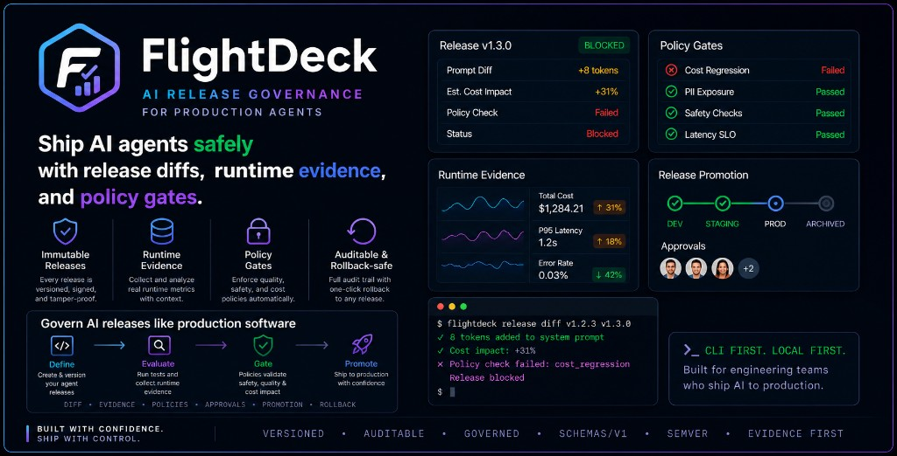
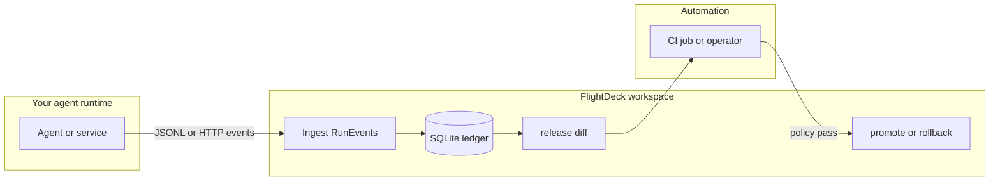

# FlightDeck

**Ship AI agents safely with release diffs, runtime evidence, and policy gates.**

Local-first **CLI + SQLite**. Optional **`flightdeck serve`** exposes a small web UI and **`/v1`** JSON API—data stays on your machine unless you change that.

**Core loop:** register releases → ingest run evidence → diff baseline vs candidate → promote or rollback under policy (optional human approval).

## Product snapshot



*Illustrative composite, not a screenshot of the shipped UI.* Policy is threshold-based on rollups from ingested runs—not built-in PII scanners. [Theming notes](docs/web-ui.md#theming-and-brand-alignment)

| | FlightDeck | Tracing SaaS | Git/CI alone |
|--|--------------|----------------|--------------|
| Focus | Release + promote governance | Sessions / traces / evals | Source + pipelines |
| Versioned release artifact | Yes | No | DIY |
| Cost/latency diff + policy gate | Yes | Different lens | DIY |

## In ~20 seconds

1. **Register** immutable agent releases (`release.yaml` + bundle checksum).
2. **Ingest** run evidence (`RunEvent` JSONL or **`POST /v1/events`**).
3. **Diff** baseline vs candidate: cost, latency, errors, and confidence (optional **pricing catalog** lines on top).
4. **Promote** only when policy passes; optional **human approval** (request → confirm) before the ledger moves.

## Why it exists

Small prompt or model changes can move **cost**, **latency**, and **error rate** in ways that are easy to miss. FlightDeck turns those into **explicit promote decisions** backed by ingested runs—before production pointers advance.

## Who should use this?

- **Platform or ML engineering** teams shipping **multiple LLM agents** to production—especially after a **cost** or **regression** tied to a **prompt** or **model** change—who want a **governed promote** path without treating a tracing SaaS as their release gate.
- **Regulated or compliance-sensitive** teams (healthcare, fintech, and similar) where **data residency**, **audit trails**, and **control over evidence and pricing data** matter; **local-first** defaults and optional self-hosted **`flightdeck serve`** fit that posture.
- Teams that **version agent builds** (prompts, tools, model pins) and need a **durable audit trail** for what shipped and what ran.
- Engineers who want a **straightforward workflow** to answer “is this candidate safe to roll forward?” with **numbers and policy**, not only gut feel or spreadsheet checklists.

## Example outcome

You ship a candidate whose **prompt or model** shifts slightly; under your tariffs the diff shows **cost per run** rising while policy caps spend. **`flightdeck release promote`** (or the HTTP promote path) **stays blocked** until you change the model, adjust policy with intent, or gather more evidence—not because CI is slow, but because the **ledger** says no. The **~31%** style story in [examples/quickstart/](examples/quickstart/) uses **two custom pricing YAMLs**; **`flightdeck init`** alone seeds a **bundled** snapshot so your first cost-aware diff is not empty.

## How it fits your stack

FlightDeck sits **next to** your agent runtime (not in the inference hot path): emit evidence, run **`flightdeck`** from a laptop or CI, gate **promote** with policy.



---

## Fast start

After **`pip install flightdeck-ai`** (or **`uv tool install flightdeck-ai`**):

```bash
flightdeck demo
```

**`flightdeck demo`** runs the full quickstart ledger flow in a disposable temp workspace—no **`sed`**, no fixture paths—using **`examples/quickstart`** from your checkout or packaged **`flightdeck/_bundled_quickstart`** from PyPI.

**Web UI** (needs a workspace in the current directory):

```bash
flightdeck init
flightdeck serve
```

Open **http://127.0.0.1:8765/**. Same end-to-end checks CI uses: **`flightdeck-quickstart-verify`** (contributors: **`uv run flightdeck-quickstart-verify`**).

---

## Install and smoke-test

```bash
uv sync --extra dev
uv run flightdeck --help
uv run flightdeck demo
uv run flightdeck-quickstart-verify
```

**pip, Windows, CI:** [DEVELOPMENT.md](DEVELOPMENT.md)

**Web UI:** `uv run flightdeck serve` → **http://127.0.0.1:8765/** · [docs/web-ui.md](docs/web-ui.md)

The UI may show a **loopback / no Bearer** status line—that is **what the server is doing**, not something you execute. Bearer mode = you set a **shared secret** on the server (`FLIGHTDECK_LOCAL_API_TOKEN`) and the same value for the UI (`VITE_FLIGHTDECK_LOCAL_API_TOKEN` or `web/.env.local` with `npm run dev`). [SECURITY.md](SECURITY.md) · [docs/http-api.md](docs/http-api.md)

---

## Example workflow (policy + two tariffs)

Substitute release IDs in the JSONL or rely on `flightdeck-quickstart-verify` for the same checks CI runs.

```bash
flightdeck init
flightdeck pricing import examples/quickstart/pricing-baseline.yaml
flightdeck pricing import examples/quickstart/pricing-candidate.yaml
flightdeck policy set examples/quickstart/policy.yaml

BASELINE=$(flightdeck release register examples/quickstart/baseline-release)
CANDIDATE=$(flightdeck release register examples/quickstart/candidate-release)

sed "s/__BASELINE_RELEASE_ID__/${BASELINE}/g" examples/quickstart/baseline-events.jsonl > baseline-events.jsonl
sed "s/__CANDIDATE_RELEASE_ID__/${CANDIDATE}/g" examples/quickstart/candidate-events.jsonl > candidate-events.jsonl

flightdeck runs ingest baseline-events.jsonl
flightdeck runs ingest candidate-events.jsonl

flightdeck release diff "$BASELINE" "$CANDIDATE" --window 7d
flightdeck release promote "$BASELINE" --env local --window 7d --reason "initial baseline"
flightdeck release history --agent agent_support --env local
```

Bundled pricing from `init` is a **convenience snapshot**—`flightdeck pricing import` for production. [docs/release-artifact.md](docs/release-artifact.md) · [RELEASE_NOTES.md](RELEASE_NOTES.md)

**More examples:** [examples/quickstart/](examples/quickstart/) · [examples/ci/](examples/ci/) · [examples/deploy/](examples/deploy/) · [examples/integration/](examples/integration/)

---

## Documentation

| Area | Links |
|------|--------|
| CLI | [docs/cli.md](docs/cli.md) |
| HTTP API (routes, auth) | [docs/http-api.md](docs/http-api.md) |
| Security / trust model | [SECURITY.md](SECURITY.md) |
| Python SDK | [docs/sdk.md](docs/sdk.md) |
| Policy, diff, promote | [docs/operations-and-policy.md](docs/operations-and-policy.md) |
| `release.yaml`, pricing, checksums | [docs/release-artifact.md](docs/release-artifact.md) |
| Pricing catalog | [docs/pricing-catalog.md](docs/pricing-catalog.md) |
| Integrations (experimental) | [docs/sdk-integrations.md](docs/sdk-integrations.md) |
| Wire schemas | [schemas/v1/](schemas/v1/) |
| Changelog · roadmap · contributing | [CHANGELOG.md](CHANGELOG.md) · [ROADMAP.md](ROADMAP.md) · [CONTRIBUTING.md](CONTRIBUTING.md) |
| Maintainer / agent rules | [AGENTS.md](AGENTS.md) · [CLAUDE.md](CLAUDE.md) |
| Support | [SUPPORT.md](SUPPORT.md) |

---

## Contributing (quick CI match)

```bash
uv sync --frozen --extra dev
uv run python -m ruff check src tests
uv run python -m pytest
uv run flightdeck demo
uv run flightdeck-quickstart-verify
uv run flightdeck --help
```

Full gates (web static, schemas, e2e): [DEVELOPMENT.md](DEVELOPMENT.md)

---

## License

Apache-2.0 — [LICENSE](LICENSE) · [NOTICE](NOTICE)

Canonical: [github.com/flightdeckdev/flightdeck](https://github.com/flightdeckdev/flightdeck)
