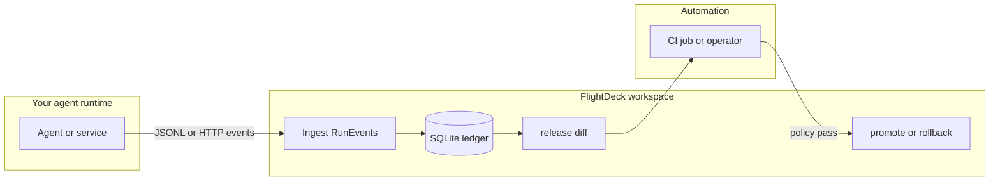

# FlightDeck

**Ship AI agents safely with release diffs, runtime evidence, and policy gates.**

FlightDeck is **local-first** (CLI + SQLite + optional **`flightdeck serve`** UI). It is not an agent framework, prompt IDE, tracing dashboard, or gateway — it is where **what shipped**, **what ran**, **what it cost**, and **whether promote is allowed** are recorded and compared.

## In ~20 seconds

1. **Register** immutable agent releases (`release.yaml` + bundle checksum).
2. **Ingest** run evidence (`RunEvent` JSONL or **`POST /v1/events`**).
3. **Diff** baseline vs candidate: cost, latency, errors, and confidence (optional **pricing catalog** lines on top).
4. **Promote** only when policy passes; optional **human approval** (request → confirm) before the ledger moves.

## Example outcome

You ship a candidate whose **system prompt drifts by a handful of tokens**; under your imported tariffs the diff shows **cost per run up ~31%** while policy caps spend. **`flightdeck release promote`** (or the HTTP promote path) **stays blocked** until you change the model, relax policy with intent, or widen evidence — not because CI is slow, but because the **governed ledger** says no.

## Who should use this?

- Teams that **version agent builds** (prompts, tools, model pins) and need a **durable audit trail**.
- Engineers who want **one command** to answer “is this candidate safe to roll forward?” with **numbers**, not gut feel.
- Anyone who has outgrown **ad hoc** folder diffs or **spreadsheet** promote checklists.

## How FlightDeck fits your stack

FlightDeck sits **next to** your agent runtime (not in the inference hot path): emit evidence, run **`flightdeck`** from a laptop or CI, gate **promote** with policy (and optional approval).



## Comparison at a glance

| | **FlightDeck** | **Langfuse** | **Arize Phoenix / Cloud** | **Git / CI alone** |
|--|----------------|----------------|---------------------------|---------------------|
| **Primary job** | **Release + promote governance** for agents (ledger, diff, policy) | Tracing, sessions, evals, LLM observability | ML / model observability and monitoring | Source control and generic pipelines |
| **Immutable release artifact** | Yes (`release.yaml` + checksum) | No | No | Only if you build it |
| **Evidence + cost/latency diff** | Yes (runs + pricing tables / optional catalog) | Different lens (trace-level) | Different lens | DIY |
| **Policy gate on promote** | First-class | No | No | DIY |

**Try the UI:** run **`flightdeck serve`**, then open **http://127.0.0.1:8765/** — Overview, Diff, and Actions (see [docs/web-ui.md](docs/web-ui.md)).

## Why it exists

Small prompt or model changes can silently move **cost**, **latency**, and **error rate**. FlightDeck turns those moves into **explicit promote decisions** backed by ingested runs — before production pointers advance.

**Current local spine:** versioned **`release.yaml`** + checksums · **`RunEvent`** ingest (JSONL or arrays) · immutable **pricing** imports · **`flightdeck release diff`** · policy-gated **`release promote`** / rollback · full **audit history**.

## Status

FlightDeck is **local-first** and ships as a Python CLI backed by SQLite.

**v1.0.0** froze **SemVer-stable public contracts** for the documented CLI, committed **`schemas/v1/`**,
and **`POST /v1/events`** with **`api_version` `v1`**. **v1.1.x** adds catalog-aware diffs, approval flows, and forensics slices (optional pricing catalog on diffs,
promotion request/confirm, read-only runs listing, **`GET /v1/workspace`** for UI and automation, Helm/fleet examples)
without breaking those v1.0 shapes. See **[RELEASE_NOTES.md](RELEASE_NOTES.md)** and **[CHANGELOG.md](CHANGELOG.md)**.
The product scope is still intentionally narrow (release governance, not a hosted agent platform).

Not implemented yet:

- hosted control plane
- automated traffic routing
- tool-cost pricing
- OpenTelemetry import/export mapping (optional **`uv sync --extra telemetry`** or **`pip install 'flightdeck-ai[telemetry]'`** for future work)

Shipped locally:

- `flightdeck serve` + JSON routes under `/v1/*` (read + diff/promote/rollback + event ingest); see **Local HTTP API** below
- minimal Python SDK (`flightdeck.sdk.client`)
- `flightdeck release rollback` (policy-gated, audited)
- optional **`promotion_requires_approval`** in `flightdeck.yaml` with **`POST /v1/promote/request`** and **`POST /v1/promote/confirm`**

### Local HTTP API

With **`flightdeck serve`** (default bind **127.0.0.1**), the app exposes **`GET /health`**, **`GET /v1/workspace`**
(read-only workspace flags for scripts and the bundled UI), **`GET /v1/metrics`**, **`GET /v1/releases`**, **`GET /v1/promoted`**, **`GET /v1/actions`**, **`GET /v1/promotion-requests`**, **`GET /v1/runs`**, **`POST /v1/events`**, **`POST /v1/diff`**, **`POST /v1/promote`**, **`POST /v1/promote/request`**, **`POST /v1/promote/confirm`**, and **`POST /v1/rollback`**. **`POST /v1/promote`**, **`POST /v1/promote/request`**, **`POST /v1/promote/confirm`**, **`POST /v1/rollback`**, and **`POST /v1/events`** accept requests only from loopback clients unless **`FLIGHTDECK_LOCAL_API_TOKEN`** is set, in which case callers must send **`Authorization: Bearer <token>`** (same behavior as the **`web/`** dev UI via **`VITE_FLIGHTDECK_LOCAL_API_TOKEN`**). **`POST /v1/diff`** stays read-only and does not use that gate. See **[docs/http-api.md](docs/http-api.md)** and **[SECURITY.md](SECURITY.md)**.

## Quickstart

Install **[uv](https://docs.astral.sh/uv/getting-started/installation/)**, then from the repo root:

```bash
uv sync --extra dev
uv run flightdeck --help
```

Or with **pip** and a venv:

```bash
python -m venv .venv
python -m pip install -e ".[dev]"
flightdeck --help
```

Run the cross-platform quickstart smoke (same as CI):

```bash
uv run flightdeck-quickstart-verify
```

(or **`python -m flightdeck.quickstart_smoke`** / **`python scripts/quickstart_smoke.py`** inside an activated venv)

Or use the bash wrapper (Git Bash / WSL on Windows):

```bash
./scripts/smoke.sh
```

Or walk through the core commands:

```bash
flightdeck init
flightdeck pricing import examples/quickstart/pricing-baseline.yaml
flightdeck pricing import examples/quickstart/pricing-candidate.yaml
flightdeck policy set examples/quickstart/policy.yaml

BASELINE=$(flightdeck release register examples/quickstart/baseline-release)
CANDIDATE=$(flightdeck release register examples/quickstart/candidate-release)

sed "s/__BASELINE_RELEASE_ID__/${BASELINE}/g" examples/quickstart/baseline-events.jsonl > baseline-events.jsonl
sed "s/__CANDIDATE_RELEASE_ID__/${CANDIDATE}/g" examples/quickstart/candidate-events.jsonl > candidate-events.jsonl

flightdeck runs ingest baseline-events.jsonl
flightdeck runs ingest candidate-events.jsonl

flightdeck release diff "$BASELINE" "$CANDIDATE" --window 7d
flightdeck release promote "$BASELINE" --env local --window 7d --reason "initial baseline"
flightdeck release history --agent agent_support --env local
```

The static event files in `examples/quickstart` use placeholder release IDs so the repo can ship stable examples.
Substitute them before ingestion, or run **`uv run flightdeck-quickstart-verify`** / **`python -m flightdeck.quickstart_smoke`** (venv) or **`./scripts/smoke.sh`** from Git Bash/WSL on Windows.

**Examples:** [examples/quickstart/](examples/quickstart/) · [examples/ci/](examples/ci/) (policy gate + Actions) · [examples/deploy/](examples/deploy/) (`serve` via Docker/Compose) · [examples/integration/](examples/integration/) (HTTP event emitter) · [examples/integration/adoption/](examples/integration/adoption/) (framework hooks).

## Documentation

- [CLI reference](docs/cli.md) — all commands, flags, arguments, and exit codes
- [HTTP API reference](docs/http-api.md) — all `/v1/*` routes, request/response shapes, auth, `RunEvent` field reference
- [Python SDK](docs/sdk.md) — `FlightdeckClient` / `AsyncFlightdeckClient` usage guide
- [Runtime integrations (experimental)](docs/sdk-integrations.md) — optional `flightdeck.integrations` mappers (LangChain, OpenAI Agents, Temporal, etc.)
- [Operations and policy](docs/operations-and-policy.md) — diff, promote, rollback internals; policy model and confidence tiers
- [Release artifacts and pricing](docs/release-artifact.md) — `release.yaml` format, bundle layout, checksum algorithm, workspace config, pricing tables
- [Pricing catalog](docs/pricing-catalog.md) — optional `pricing_catalog_path`, catalog vs imported tables, troubleshooting
- [JSON Schemas](schemas/v1/)
- [Release notes (maintainer)](RELEASE_NOTES.md)
- [Roadmap](ROADMAP.md)
- [Versioning](VERSIONING.md)
- [Development](DEVELOPMENT.md)
- [Contributing](CONTRIBUTING.md)
- [Security](SECURITY.md)
- [CLAUDE.md](CLAUDE.md) and [AGENTS.md](AGENTS.md)

## Development

```bash
uv sync --frozen --extra dev
uv run python -m ruff check src tests
uv run python -m pytest
uv run flightdeck-quickstart-verify
uv run flightdeck --help
```

If you change **`web/`** or **Pydantic models**, also run the **`static/`** and **`schemas/`** drift checks from **[DEVELOPMENT.md](DEVELOPMENT.md)** (same gates as **`.github/workflows/ci.yml`**). **[AGENTS.md](AGENTS.md)** and **[`.cursor/rules/flightdeck-ci-artifacts.mdc`](.cursor/rules/flightdeck-ci-artifacts.mdc)** summarize them for humans and Cursor.

See [DEVELOPMENT.md](DEVELOPMENT.md) for **uv** and **pip** setup, verification, troubleshooting, and **PyPI releases** (tag-driven; not on merge to `main`).

## License

FlightDeck is licensed under the **Apache License, Version 2.0** — see [`LICENSE`](LICENSE) and [`NOTICE`](NOTICE).

The canonical public repository: [https://github.com/flightdeckdev/flightdeck](https://github.com/flightdeckdev/flightdeck).
